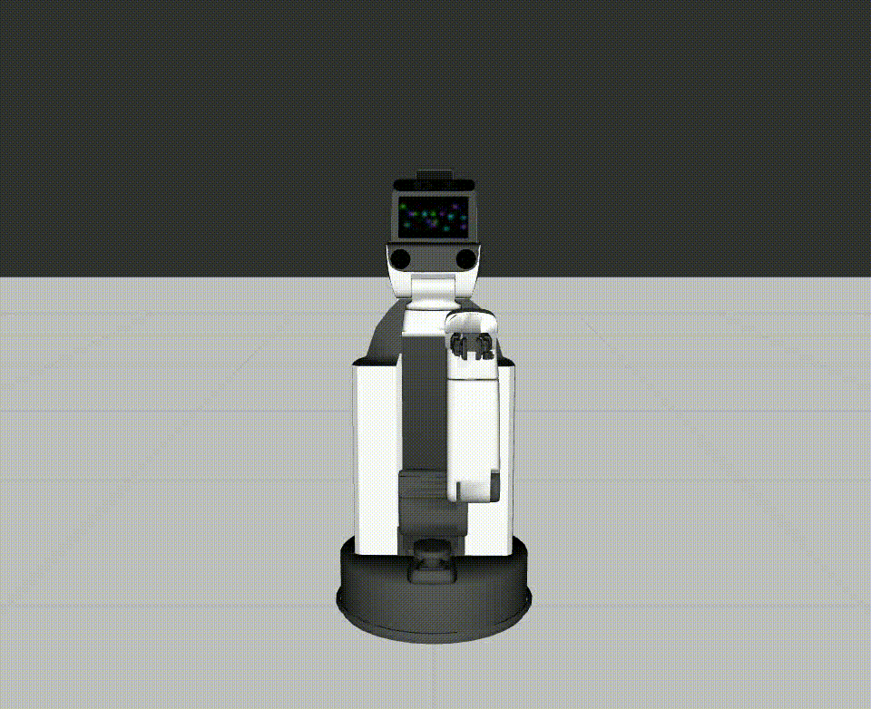
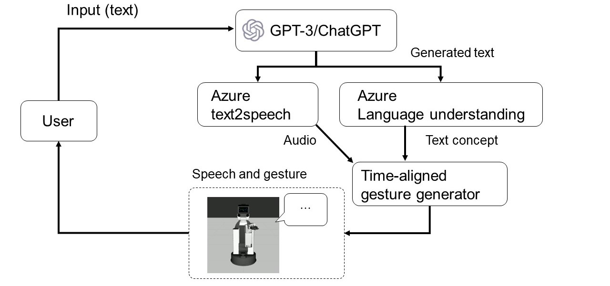
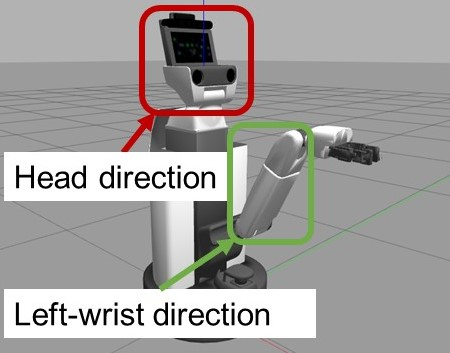
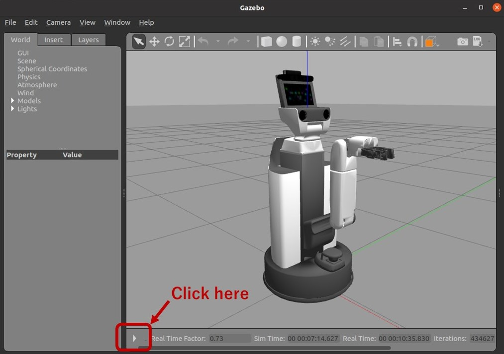

# GPT-Enabled-HSR-CoSpeechGestures



## About this repository
This repository contains source code to generate HSR co-speech gestures using the official Python interface of the Toyota HSR robot. The chat system utilizes GPT as its backend.


## Pipeline

When a user inputs a message, GPT-3/ChatGPT generates the robot’s textual response based on a prompt carefully crafted to create a chat-like experience. The pipeline then utilizes a gesture engine to analyze the text and select an appropriate gesture from a library associated with the conceptual meaning of the speech. A speech generator converts the text into speech, while a gesture generator executes co-speech gestures, providing audio-visual feedback expressed through an HSR robot.
Related materials:
* [Our blog post](https://www.microsoft.com/en-us/research/?post_type=msr-blog-post&p=927303&preview=true)
* [GPT-based chatbot (MSRAbot)](https://github.com/microsoft/LabanotationSuite/tree/master/MSRAbotChatSimulation)


## Labanotation to HSR motion
Gestures are expressed based on Labanotation, which is a notation system for human dance ([example](https://github.com/microsoft/LabanotationSuite/blob/master/MSRAbotChatSimulation/data/LabanotationLibrary/away.json)). By mapping the human body onto the robot body, the robot's motion is generated. As HSR has only one arm, we mapped the left hand and head movements of Labanotation to HSR. In particular, we reflected the direction from the elbow to the wrist specified in Labanotation onto the direction of HSR's arm.
For reference, we proveide examples of Labanotation to HSR motion in the [gesture_videos](./gesture_videos) folder.




## Prerequisites
You need to have a laptop setup for the use of the HSR robot. See [this website](http://hsr.io/) for instructions on how to set up a laptop for use with the HSR robot.
Install necessary packages:
```bash
pip install -r requirements.txt
```
In addition, download the [data](https://github.com/Naoki-Wake/LabanotationSuite/tree/master/MSRAbotChatSimulation/data) folder from [here](https://github.com/Naoki-Wake/LabanotationSuite/tree/master/MSRAbotChatSimulation/data) and put it in the root directory of this repository.


## Azure subscription
To use this repository, you need an [Azure OpenAI](https://learn.microsoft.com/en-us/azure/cognitive-services/openai/overview)subscription for text generation and an [Azure speech service](https://learn.microsoft.com/en-us/azure/cognitive-services/speech-service/overview) subscription for speech generation. We also use [Azure Language Understanding](https://learn.microsoft.com/en-us/azure/cognitive-services/language-service/conversational-language-understanding/overview) for concept estimation, but it is optional and you will need to train the model separately. We trained our Language Understanding models on [this database](data/sentence-concept_database.csv).
To insert your subscription keys, open the [secrets.json](./secrets.json) file.


## Preparation (when using a simulator)
Launch an environment for the HSR robot:
```bash
roslaunch hsrb_gazebo_launch hsrb_empty_world.launch
```
Click the play button in the Gazebo window to start the simulation.
image:





## How to run
Open a terminal and run the following command:
```bash
python main.py
```


## Notes when using a simulator
The code sends motion commands to the simulator while the speech synthesized by the Azure Speech Service is played in the background. However, since the HSR motion is moving in simulation time, it is not guaranteed that the voice and motion will be played synchronously.
## Contributing

This project welcomes contributions and suggestions.  Most contributions require you to agree to a
Contributor License Agreement (CLA) declaring that you have the right to, and actually do, grant us
the rights to use your contribution. For details, visit https://cla.opensource.microsoft.com.

When you submit a pull request, a CLA bot will automatically determine whether you need to provide
a CLA and decorate the PR appropriately (e.g., status check, comment). Simply follow the instructions
provided by the bot. You will only need to do this once across all repos using our CLA.

This project has adopted the [Microsoft Open Source Code of Conduct](https://opensource.microsoft.com/codeofconduct/).
For more information see the [Code of Conduct FAQ](https://opensource.microsoft.com/codeofconduct/faq/) or
contact [opencode@microsoft.com](mailto:opencode@microsoft.com) with any additional questions or comments.

## Trademarks

This project may contain trademarks or logos for projects, products, or services. Authorized use of Microsoft 
trademarks or logos is subject to and must follow 
[Microsoft's Trademark & Brand Guidelines](https://www.microsoft.com/en-us/legal/intellectualproperty/trademarks/usage/general).
Use of Microsoft trademarks or logos in modified versions of this project must not cause confusion or imply Microsoft sponsorship.
Any use of third-party trademarks or logos are subject to those third-party's policies.
